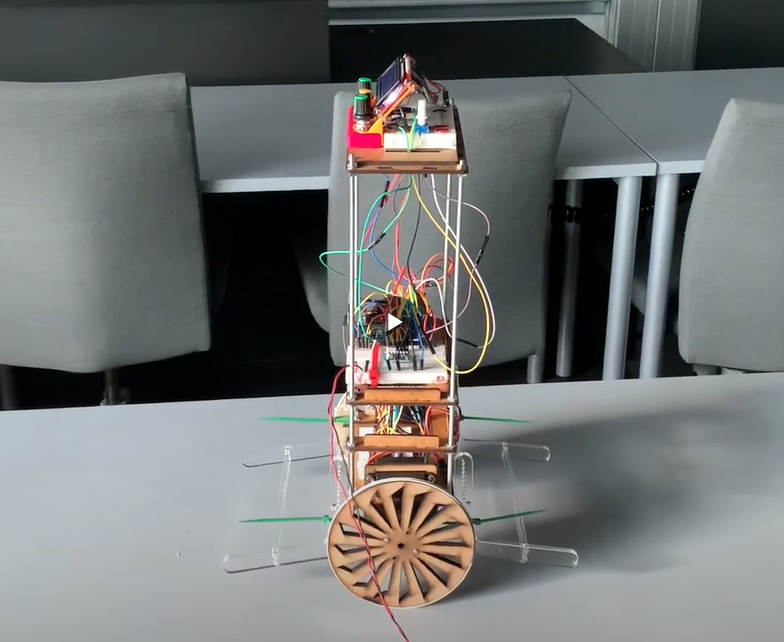

# Self Balancing Robot

*ITU - Summer 2022 - How to Make (almost) Anything*

**Team members:**

- Anders Latif
- Boris Karavasilev
- Stefan Bjerring Henriksen

The full report can be found [here](./report.pdf).

## Introduction

In the second year of my master's degree, I took the specialization course "Advanced Robotics". In this course, me and my two friends built a self-balancing robot. We implemented and calibrated a PID controller on an Arduino. We also designed the entire body of the robot in Fusion 360 and used a combination of 3D printing and laser cutting to manufacture the robot. We tested the robot in various conditions and documented the results in a report.

## Design Brought To Reality

.png)

## Video
👇 To see our robot in action click on the image below. 👇

